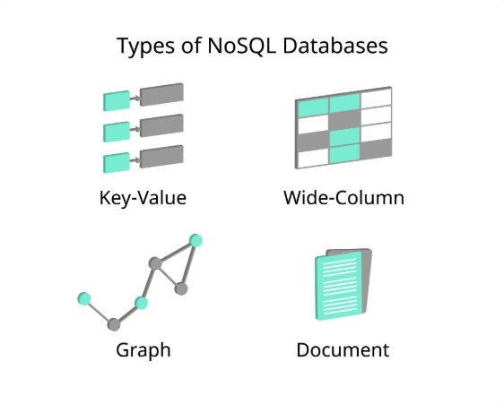

# 1. Introducción

**¿Qué es NoSQL?**{.azul}

El término **NoSQL** (*Not Only SQL*) hace referencia a bases de datos que no sean el modelo relacional. En algunos casos, pueden ser más eficientes porque permiten una estructura de datos más flexible.  

None

**Tipo de Bases de Datos NoSQL**{.azul}

Según la forma en la que se almacenan las datos, podemos encontrar diferentes categorías: 

  
  * **Bases de Datos Orientados a Documentos** (o simplemente Bases de Datos Documentales), para guardar documentos de determinados tipos: XML, JSON, ... Por ejemplo **eXist** que guarda documentos XML, o **MongoDB** que guarda la información en un formato similar a JSON. O **Firebase** , una Base de Datos que utiliza también el formato JSON y que en tiempo real permite sincronizar con el nube las datos locales.
  * **Bases de Datos Clave-Valor** , para guardar información de forma muy sencilla, guardando únicamente la clave (el número de la propiedad) y su valor. Un ejemplo es **Redis**.
  * **Bases de Datos Orientados a Grafos**, para guardar estructuras como los grafos, donde hay una serie de nodos y aristas que comunicarían (relacionarían) los nodos. Un ejemplo es **Neo4j**.
  * **Bases de Datos Orientados en Columna**, que tiene una estructura parecida a las tablas del Modelo Relacional, pero orientado a las columnas (o familias de columnas, por lo que un grupo de columnas se guarda en el mismo sitio). Un ejemplo es **Cassandra**.
  * Otros tipos como las **Bases de Datos Multivalor**, las **Bases de Datos Tabulares**, ...

Licenciado bajo la [Licencia Creative Commons Reconocimiento NoComercial
SinObraDerivada 4.0](http://creativecommons.org/licenses/by-nc-nd/4.0/)

