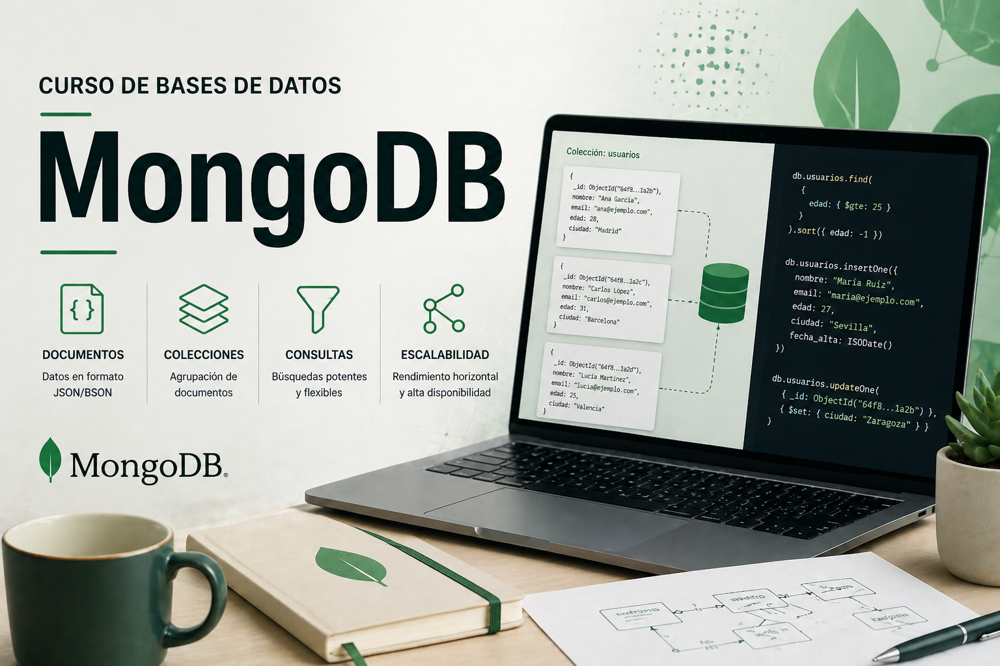

<!---->

Bienvenidos al material de apoyo y la documentación del curso de Bases de Datos, dedicado al estudio de los gestores NoSQL, con especial atención a MongoDB.

Licenciado bajo la [Licencia Creative Commons Reconocimiento CompartirIgual
2.5](http://creativecommons.org/licenses/by-sa/2.5/)